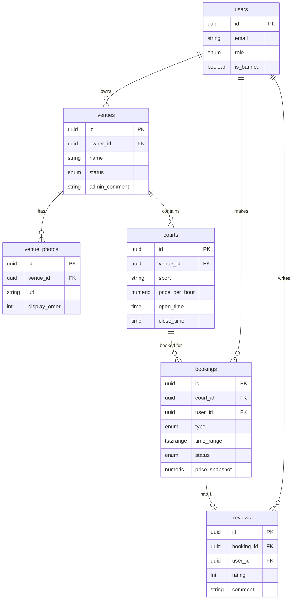

# QuickCourt

QuickCourt is a full-stack platform to discover, book, and manage sports courts.
See **[DESIGN.md](./DESIGN.md)** for the full architecture and design rationale
(database, modularity, security, performance).

## Getting Started
```bash
docker compose up -d                         # Postgres
cd server && python -m venv venv && source venv/bin/activate
pip install -r requirements.txt
python seed.py                               # apply migrations + demo data
uvicorn main:app --reload                    # API  → http://localhost:8000/docs
cd ../client && npm install && npm run dev   # UI   → http://localhost:5173
```
Demo logins (password `password123`): `admin@quickcourt.com`, `owner1@quickcourt.com`, `user1@quickcourt.com`.

## Layout
- `server/app/` — modular FastAPI app: `core/` (config, db, security), `routers/` (auth, venues, bookings, owner, admin), `services/`, `schemas.py`, `dependencies.py`.
- `server/migrations/` — ordered SQL migrations applied by `migrate.py` (tracked in `schema_migrations`).
- `client/src/` — React + TypeScript frontend (React Query, React Router, Tailwind).

## Problem Summary
QuickCourt is a platform to discover, book, and manage sports courts. It solves the friction of finding available courts across multiple venues, dealing with overlapping bookings, and managing venue operations securely.

## Assumptions
- Bookings are in 1-hour slots or similar discrete blocks.
- Payments are handled out-of-band or simulated (fake payment for MVP).
- Only completed bookings can be reviewed.
- Maintenance blocks and regular bookings must not overlap.
- Canceled bookings free up the slot for others.

## ERD


## Security List
- Role-based Access Control (RBAC): Distinct actions and data visibility for users, owners, and admins.
- EXCLUDE USING gist: Guarantees at the database level that overlapping active bookings cannot exist, effectively eliminating race conditions without relying strictly on application-level locks.
- Banned users cannot act on the platform, enforced via middleware/auth checks.
- Venues must be approved by admin before public visibility.
- Reviews can only be left if `status = 'completed'` enforcing integrity at the DB level via a composite FK.

## Index Rationale
- `owner_id` on `venues` for fast lookups by owners.
- `status` on `venues` to quickly filter approved venues for the public.
- `venue_id` on `courts` and `venue_photos` for efficient JOINs.
- `court_id` and `user_id` on `bookings` to optimize fetching availability and user history.
# QuickCourt
